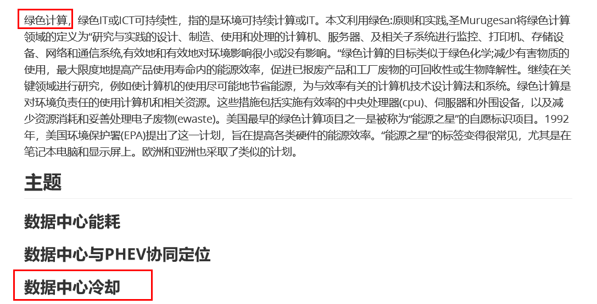

[TOC]
##  组合数学进度记录

## 开题报告

[组合数学网址](http://good.ncu.edu.cn/~xuz/ic/homepage.html)

[组合数学大作业题目中文版](./zh_cn_com.pdf)

### 申明：

==我们的题目是:==

现在我们要写开题报告了，需要大家读论文来收集资料，为了获取更多的相关信息，我号召大家一起读论文。以下有24篇论文（来源与百度学术搜索引擎），==[点此进入查看](./article_list.md)==

*具体分配为：*

| 姓   | 范围  |
| ---- | ----- |
| 杨   | 1-6   |
| 章   | 7-13  |
| 晏   | 14-20 |
| 范   | 21-24 |

提取其中相关信息记录成文档，重点提取的内容按照往届开题报告来思考:

**备注：** 有的文献可能相关性不是很高，靠自己的判断去查找更有用的信息

已经收集到的信息>>

